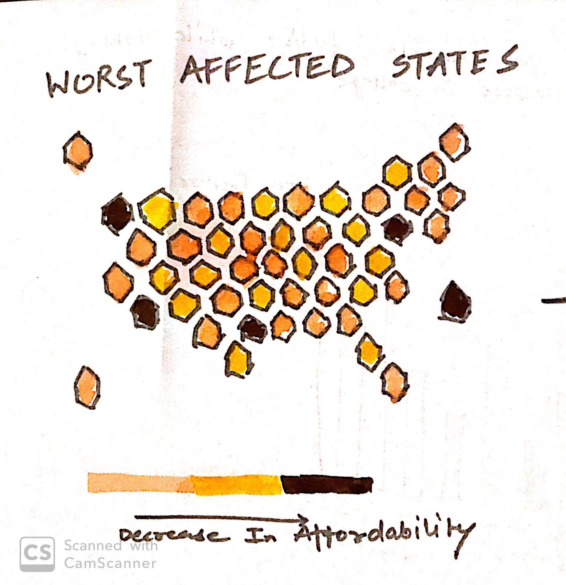
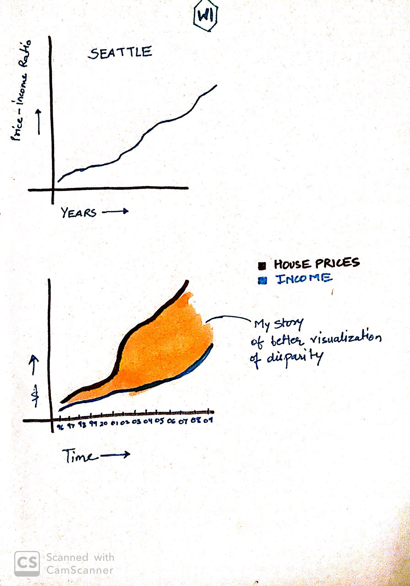
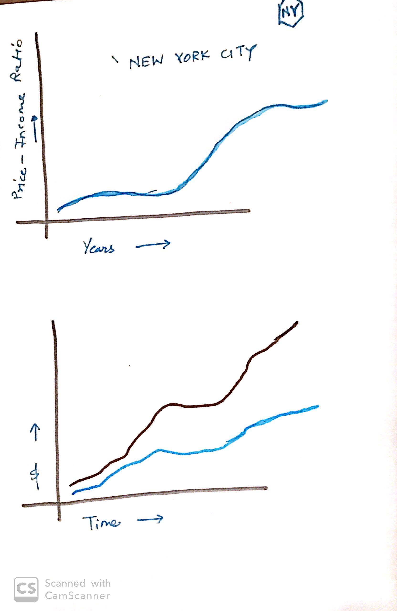
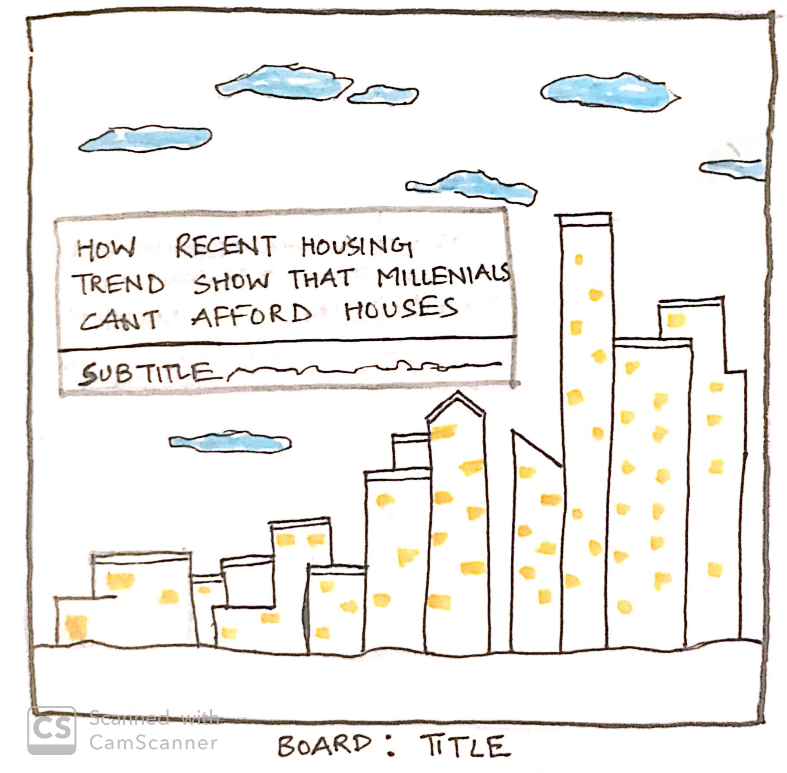
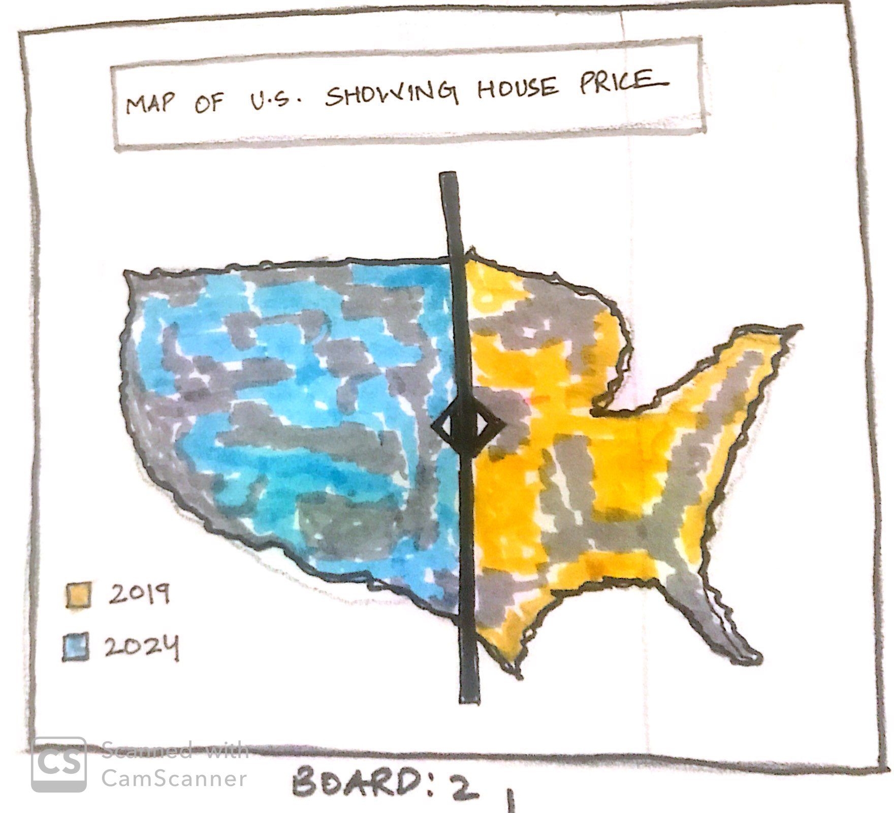
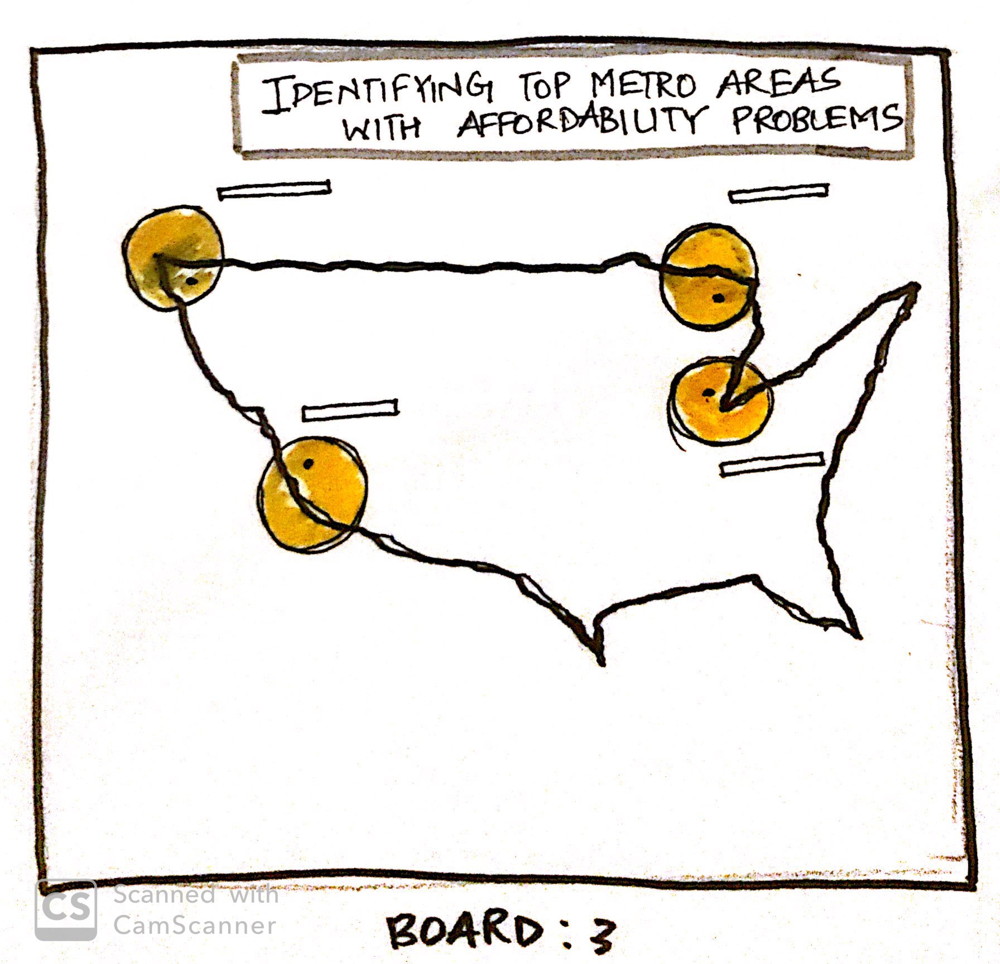
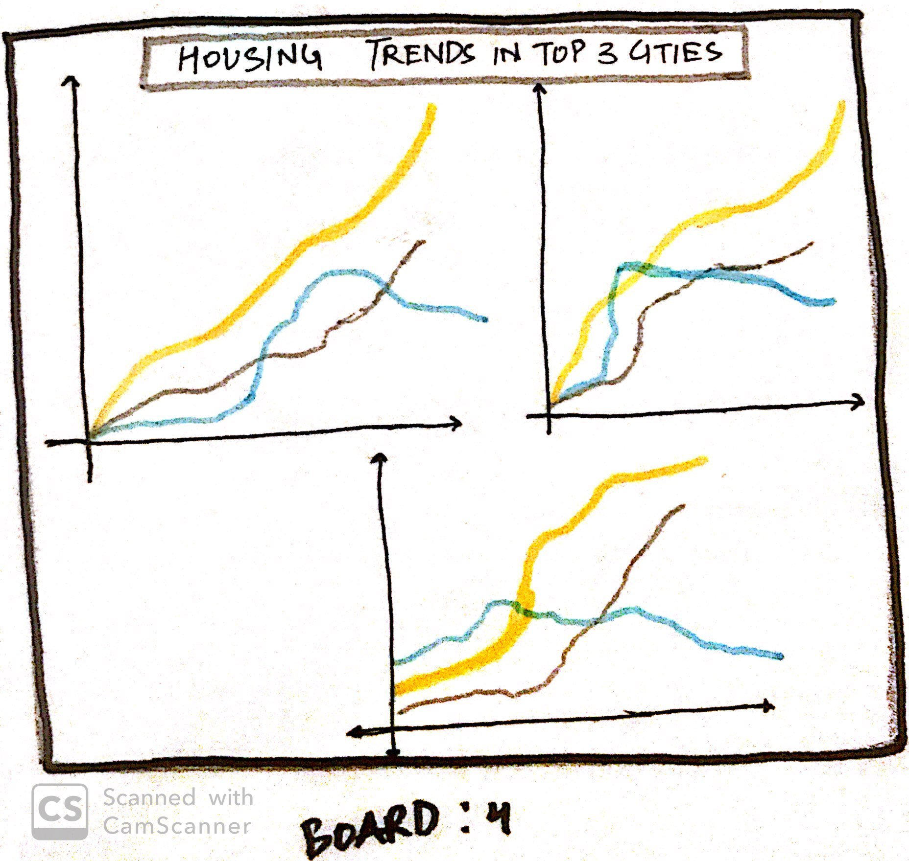
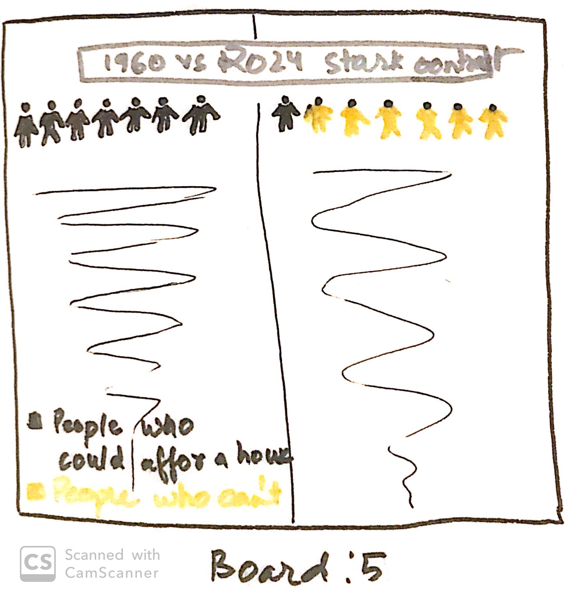
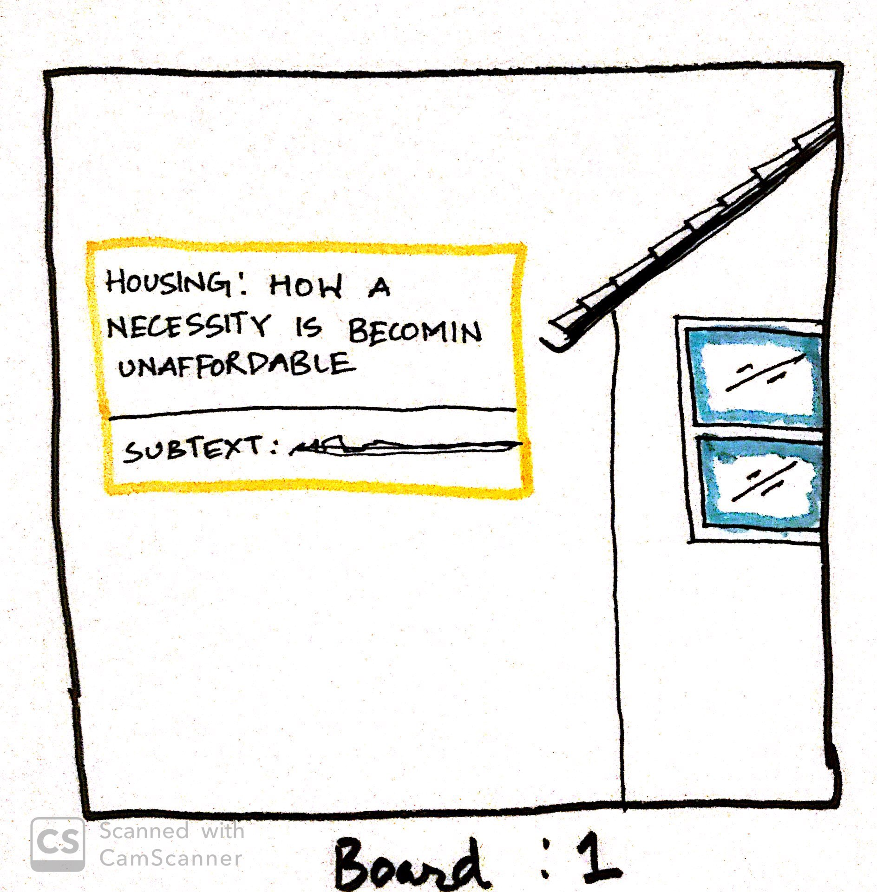

# Analyzing Housing Affordability Trends of Major Cities in US | Final Group Project 
## Project Outline
### Housing Affordability Issue: 
This project will aim to show how increasing disparity between income and housing prices have made it extremely difficult for people to buy homes. The difference (in affordability) will be shown by comparing median household prices and median household income over the years. 
These trendlines will accurately showcase how it has become impossible for almost all millennials to own homes. 
The story arc:
Housing prices in the major cities of US have been increasing by a drastic pace for a long time now. Unfortunately for people, their income level has not kept up with this steep increasing. 
As a direct result, buying real estate for investment or living purposes has become extremely difficult for most. This trend is relatively new and affects the current working population the most. 
One example of a matrix used to accurately gauge the relationship of housing prices and income levels is price-income ratio. Where price of a house over income of a household is calculated and used for the basis of analysis. In this aanalysis, 'median' values over regions and time were chosen as their values cn't be skewed by valuations of large exotic homes or small affordable, inexpensive houses. 

The final aim of this analysis to inform its audience about this detrimental trend, how it affects them, and ineffectiveness of policy decisions taken by authorities pertaining to affordability of houses. It would alos highlight which cities are going to turn more affordable than their current state. 

## INITIAL SKETCHES

## DATA
The source of data used for this project would be Zillow. Zillow is a private organization which collects, organizes and analyses real estate trends in United States. 
They collaborate officially with Tableau and ESRI to organize data viz competitions and conferences like Iron Viz annually. The project will use a lot of Zillow specific terminology to make the users understand the data they are looking at. 
Important Zillow Terminology: https://www.zillow.com/info/whats-the-zillow-home-value-index/ , https://wp.zillowstatic.com/3/ZHVI-InfoSheet-04ed2b.pdf
Core data used: https://www.zillow.com/research/data/ Note: TO download the data go to home values, ZHVI All Homes and choose Metro and U.S.
This data provides City names with their respective Zillow Home Index Values since year 1996 for every month. 
Median Household Income Data: https://www.arcgis.com/home/item.html?id=6db428407492470b8db45edaa0de44c1 , ESRI provides data on an early basis, this would be used to calculate the median household income. 

## Method and Medium
1. The data for ESRI would be used to create a map of U.S. (Using ArcGIS) to understand the cities which have experienced the highest growth over the past 20 years. This data would be visualized using a choropleth map as shown in the sketches.
2. Five cities would be shortlisted based on this analysis as key cities for further examination. 
3. Data from Zillow would be used to understand the pricing trends for real estate pertaining to these cities. 
4. Median Household Income for these cities would be extracted (Y-1996 to Y-2019).
5. Tableau would be used to visualize the data and create a dashboard which tells the entire story n the most concise manner. 
6. As a last part of the project Shorthand would be used to present the story in the most effective way by adding more compelling visuals and images to add to the value of the analysis. 
Overall, the project would use a combination of ArcGIS and Tableau for its analysis purposes, i.e. to compute means, medians, aggregations and trend analysis. They will also be used for visualization purposes and Tableau would be speciifcally be used for creating a dashboard. 
Later, for storytelling purposes Shorthand would be used.

## Initial Storyboards
The initial storyboards were created after completing a primilinary analysis on ArcGIS to get an understanding of the dataset being analysed. The project would use GIS to create choropleth maps of U.S. counties; and Tableau to visualize trendlines of prices and income. Further to refine the dataviz, Adobe InDeisgn would be used. The mode of presentation would be based on Esri Story Maps.

#### This Slide gives the users an understanding of what the project is about and its problem statement.

The slide shows the housing trends and pricing forecasts for year 2024. The slider in the middle helps the user navigate both maps simultaneously.

The slide shows the areas when housing prices are high and might have affordability issues. These are the selected areas, where further reasearch would be conducted. 

These are the price-income trendlines for the chosen cities. These trendlines would demonstrate the "gap" and affordability issues. 

## User Research Protocol
The intended audience for this project is general population and millenials specifically. People who have faced affordability issues when they ever thought of buying homes. A segment of the pupolation could also be casual analysts looking for price-income trends of specific cities under consideration. For feedback purposes, three Carnegie Mellon Students were chosen from diverse backgrounds and fields of interests. Their feedback was used to make alterations in the design of the story and make it more informed. The feedback was incorporated in the design of the visuals along with the methodology of story telling. 
### Question 1: What do you understand by the Storyboards?
#### Answer 1: The gap in income of people versus the price of houses in the market currently.
#### Answer 2: How real estate has become less affordable in recent years.
#### Answer 3: Which cities have the most expensive housing in general. 
### Question 2: How easy it is for you to understand the data being analysed?
#### Answer 1: Easy, good methodology of visualization.
#### Answer 2: Simple yet effective.
#### Answer 3: (Was visibly disoriented by choropleth map) Fair.
### Question 3: What do you think is the aim of this project?
#### Answer 1: To show how some cities have affordability issues in terms of housing. 
#### Answer 2: To show how income is not matching to prices of real estate commodities.
#### Answer 3: What areas are plagued by affordable housing issues.
### Question 4: Do you like the aesthetic of these visuals?
#### Answer 1: Yes. Less colors more meaning. The image intended to be used for title slide should be more minimal.
#### Answer 2: More contrast should be used to show stark contrast in price and income.
#### Answer 3: Yes, everything looks clear except for the 2nd storyboard.
### Question 5: What does the story lack?
#### Answer 1: A more personal feel.
#### Answer 2: How does it affect me or my generation.
#### Answer 3: (Stayed fixated on 2nd storyboard). 
### Question 6: Do you believe this research and visauls are authentic and reliable?
#### Answer 1: Yes
#### Answer 2: Yes
#### Answer 3: Yes
### Question 7: What would you add to this story?
#### Answer 1: More visuals to make the story even more clear.
#### Answer 2: Nothing it looks perfect.
#### Answer 3: Maps of cities under consideration. 

## Revised Wireframes
Based on the feedback, it was decide that the image on the title slide would be changed to keep it more minimal and informative. It was further decided that to better visualize the impact of affordability, a simple yet effective visualization would be added to the project. The aim of this graphic would be to show how this issue affects, our generation in general. The feedback also suggested that a brief discriptive explaination of data should be added to the slides for better understanding. 
The aim of the final project would be to:
#### Keep the color palette constant and color changes to a miminum.
#### Keep the visuals simple and comprehensible.
#### Add a brief discription of the data.
#### Keeping the overall aesthetic homogeneous across all the slides.
#### A more simple yet discriptive Title of the project should be thought of. 

## Changed/Added Slides

Along with aforementioned changes, the graphs would be made more detailed with Tableau to better understand the Year on year trends in the market. 

## Final Thoughts on the Project
I had to drop some of the earier concepts that I thought would be beneficial for the project like plotting seperate trendlines for income and prices. This was done for support and reinfrocement of the narrative. The story revolves arund how the affordability in recent times in US has evolved or rather increased. The shortlisted cities show how recent generations suffers from reliability on expensive habitat lifestyle in growing and trendy cities as the houses are not affordable. 

## Final Project Link
https://storymaps.arcgis.com/stories/ed1b9fda946e4b03a3db7e3e3a28230e

